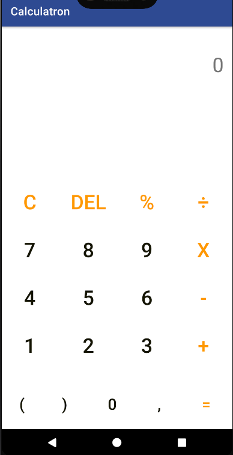

# Calculatron

That is an Android calculator app.

It has two modes: Simple mode and scientific mode:

## Simple Mode:

Contains a simple calculator. In this mode, you will have make simple operations.

## Scientific Mode

In this mode, you will be able to solve more complex operations, including trigonometric operations, logarithms, factorial, etc etc...

To enter to this mode, you only need to turn over your mobile phone

